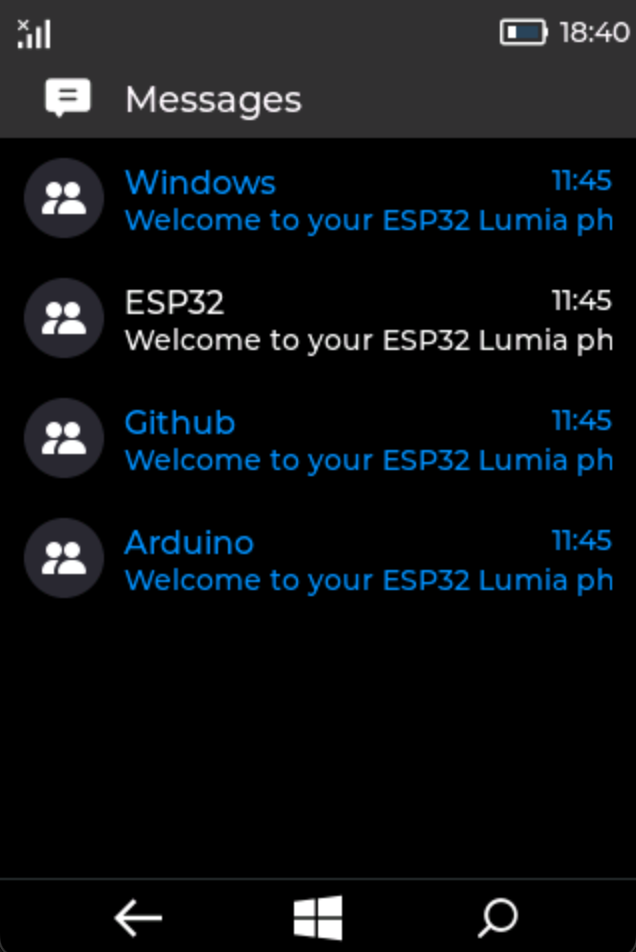

# Lumia-ESP32
This is a demo project for the WT32-SC01 module.

[`IOS UI`](https://github.com/fbiego/IOS-ESP32) for WT32-SC01

<!--  -->

### [`Simulator Code`](https://github.com/fbiego/lv_platformio)
- tested on Mac

### Compiling
Use `Espressif 32` v5.1.1 as the platform. If you have a higher version, you will need to uninstall then install v5.1.1

These are the current features
### Screens
- Boot Screen
- Lock Screen (with passcode)
- Start Menu
- Apps List
### Apps
- Phone 
- Messaging
- Settings
- Calendar
- Wifi Config
### Modules
- Status Bar
- Notification Panel
- Navigation Bar (needs ext Motor for vibration)
- Alert Dialog
- Keyboard

